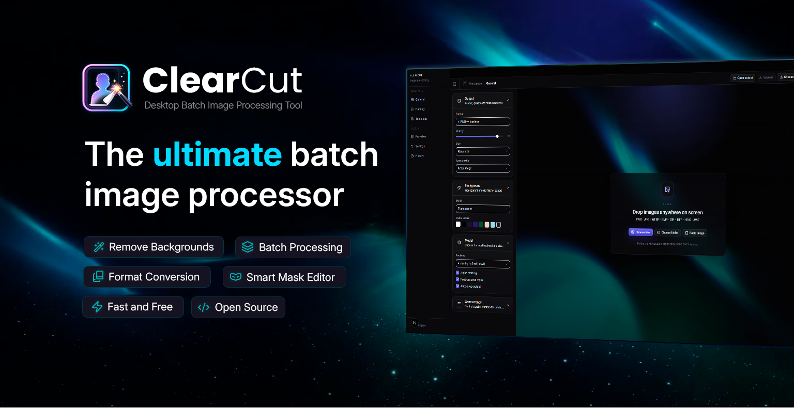
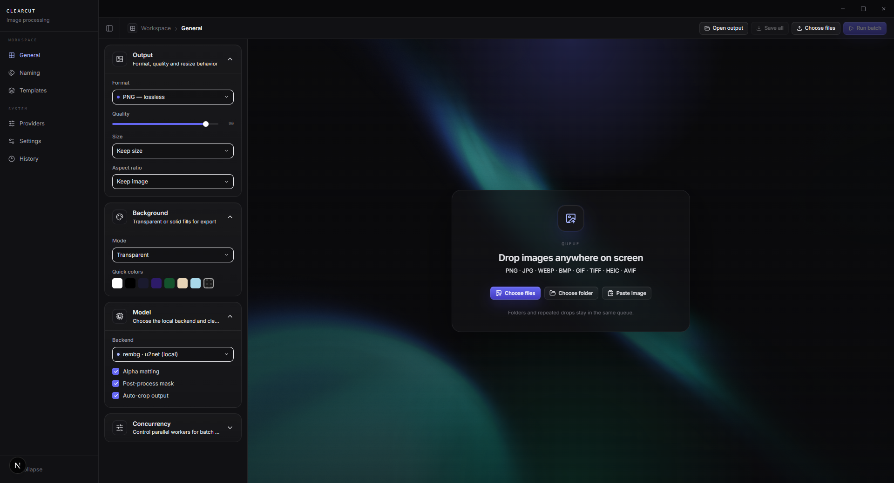

<p align="center">
  
</p>

<h1 align="center">ClearCut</h1>

<p align="center">
  Desktop-first background removal and image export tool built for fast production workflows.
</p>

<p align="center">
  Maintained by <a href="https://www.lucashdo.com/">Lucas Henrique Diniz</a> ·
  <a href="mailto:lucashdo@protonmail.com">lucashdo@protonmail.com</a>
</p>

<p align="center">
  
  
  
  
</p>

<p align="center">
  <a href="https://github.com/LucasHenriqueDiniz/clearcut/releases/latest">
    
  </a>
</p>

<p align="center">
  
</p>

## What it does

ClearCut is designed for high-volume image workflows on desktop.

Main use cases:

- remove background in batches
- convert formats
- trim transparent bounds
- apply background color
- refine masks manually
- export with naming rules
- save everything to a folder or ZIP

## Highlights

- Native desktop import:
  - file picker
  - folder picker
  - drag and drop
  - clipboard paste
- Batch queue with per-file states
- Local background removal with model selection
- Optional provider fallback
- Manual mask editor
- Output controls:
  - PNG / WebP / JPEG / AVIF
  - quality
  - keep size or custom size
  - aspect ratio
  - transparent or solid background
- Naming controls:
  - keep original
  - custom pattern
  - OCR text naming with Tesseract
- Save all outputs
- Save as ZIP
- History and provider settings

## Stack

- Frontend:
  - Next.js 15
  - React 19
  - TypeScript
  - Tailwind CSS
  - Zustand
  - Framer Motion
- Backend:
  - FastAPI
  - Pillow
  - rembg
  - pytesseract
- Desktop shell:
  - Tauri 2
  - Rust bootstrap

## Architecture

ClearCut is desktop-first.

The flow is:

1. Files are selected natively
2. The frontend keeps UI state and previews
3. The backend processes images from disk
4. Outputs are written locally
5. The app exposes native actions like:
   - open output folder
   - reveal file
   - save all
   - save as ZIP

## Project structure

```text
backend/
  app/
  data/
  outputs/
  uploads/

frontend/
  app/
  components/
  features/
  lib/
  services/
  stores/
  types/

src-tauri/
  capabilities/
  resources/
  src/
```

## Run locally

### Prerequisites

- Node.js 20+
- Rust toolchain
- Python 3.12 or 3.13

### Backend

Windows:

```bash
cd backend
python -m venv .venv
.venv\Scripts\activate
pip install -r requirements.txt
```

Linux / macOS / WSL:

```bash
cd backend
python3 -m venv .venv
source .venv/bin/activate
pip install -r requirements.txt
```

### Frontend

```bash
cd frontend
npm install
```

### Start desktop app

```bash
cd frontend
npm run tauri:dev
```

Or:

```bash
make tauri-dev
```

## Build

Build backend sidecar:

```bash
python scripts/build-backend-sidecar.py
```

Build installer:

```bash
cd frontend
npm run tauri:build
```

## Docker

If you want the web stack in containers:

```bash
docker compose up -d --build
```

Frontend:

```text
http://localhost:3000
```

Backend docs:

```text
http://localhost:8000/docs
```
